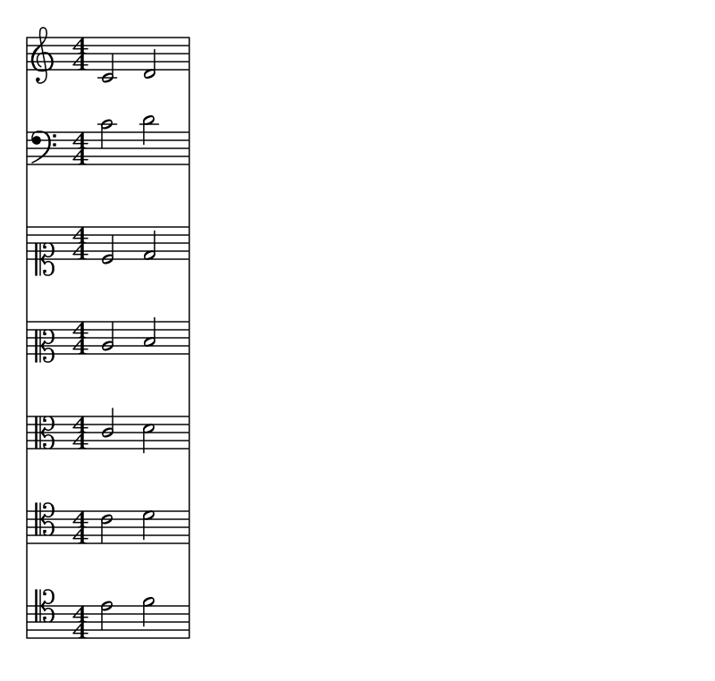
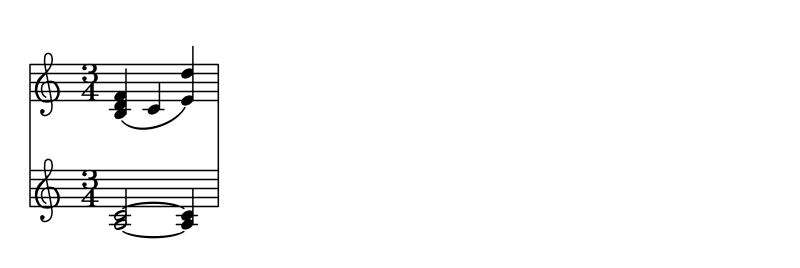
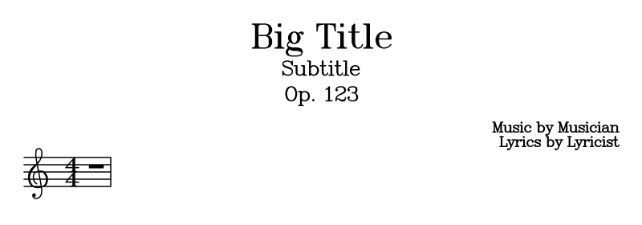

<!-- ------- GENERATED FILE DO NOT EDIT! ------- -->
<!-- tools/syntax.md, tools/illustrate_syntax.js -->
# Legumes' Markup Syntax

<!-- - [Legumes' Markup Syntax](#legumes-markup-syntax) -->
  - [Introduction](#introduction)
  - [Notes & Rests](#notes--rests)
  - [Staves & Time Signature](#staves--time-signature)
  - [Clefs](#clefs)
  - [Chords](#chords)
  - [Accidentals & Key Signature](#accidentals--key-signature)
  - [Measures](#measures)
  - [Voices](#voices)
  - [Slurs & Ties](#slurs--ties)
  - [Grace Notes](#grace-notes)
  - [Tuplets](#tuplets)
  - [Articulations & Ornaments](#articulations--ornaments)
  - [Dynamics, Pedal Marks, etc.](#dynamics-pedal-marks-etc)
  - [Crescendos & Diminuendos](#crescendos--diminuendos)
  - [Lyrics](#lyrics)
  - [Instruments](#instruments)
  - [Barlines](#barlines)
  - [Tempo](#tempo)
  - [Title & Composer](#title--composer)
  - [Comments](#comments)

## Introduction

legume's markup format aims to be concise and human-writable. This minimal example below renders a measure with a middle-C quarter note:

```
measure
  staff
    note C5 d4
  end
end
```


`C5` specifies the name and octave of the note. `d4` indicates the `d`uration of the note to be 1/`4`th, i.e. the quarter note. Note that in legumes, `C5` is the middle C (like in MIDI). The octave can be any positive or negative integer, though 0-9 would be the most common (and audible).

The format is delimited by whitespace, and treats all whitespace characters (spaces, tabs, newlines) the same. The positioning of whitespace is significant, while consecutive whitespaces are treated as one. For example, the below does exactly the same as above.

```
measure  staff note C5 d4 end  end
```


## Notes & Rests

To add more notes to the measure, list them within the `staff` block, like so:

```
measure
  staff
    note B4 d4
    note C5
    note D5
    note E5
  end
end
```


Notice that only the duration of the first of several consecutive notes need be specified; That of the rest will be automatically inferred from the previous.

Rests can similarly by specified with the `rest` command, with a `d` argument.

legumes currently supports durations ranging from whole to 64th note.

```
measure
  staff
    note C5 d1
    rest    d1
    note C5 d2
    rest    d2
    note C5 d4
    rest    d4
    note C5 d8
    rest    d8
    note C5 d16
    rest    d16
    note C5 d32
    rest    d32
    note C5 d64
    rest    d64
  end
end
```


Notes that are eligible for beaming as determined by time signature and note duration are automatically beamed:

```
measure
  staff
    note C5 d8
    note D5
    note E5 d16
    note F5
    note G5
    note A5
    note B5 d8
    note C6
    note D6
    note E6
  end
end
```


Additionally, the duration argument (for notes) can be suffixed with a dot "`.`", which indicates the note length modifier. For instance:

```
measure
  staff
    note C5 d8.
    note D5 d16
  end
end
```


## Staves & Time Signature

To specify the time signature of a staff, add argument `m/n` to the block, like so:

```
measure
  staff 3/4
    note C5 d4
    note D5
    note E5
  end
end
```


As you might have noticed earlier, the default time signature is `4/4` if none is specified.

To create more than one staff, list them in the `measure` block. For example:

```
measure
  staff G 4/4
    note C5 d4.
    note C5 d8
    note E5 d4
    note G5
  end
  staff F 4/4
    note C4 d2
    note C4
  end
end
```


Notice the `G` and `F` next to the beginning of `staff` block. They respectively indicates G-clef and F-clef. The default is `G`.

## Clefs

In addition to `G` and `F` clef, various `C` clefs are also supported. They are `Cs` (soprano), `Cm` (mezzo-soprano), `Ca` (alto), `Ct` tenor, `Cb` (baritone):

```
measure
  staff G    note C5 d2  note D5   end
  staff F    note C5 d2  note D5   end
  staff Cs   note C5 d2  note D5   end
  staff Cm   note C5 d2  note D5   end
  staff Ca   note C5 d2  note D5   end
  staff Ct   note C5 d2  note D5   end
  staff Cb   note C5 d2  note D5   end
end
```



## Chords

To draw chords, we can make use of the `chord` block, like so:


```
measure
  staff
    chord
      note D5 d4
      note F5
      note A5
    end
    rest d4
    rest d2
  end
end
```


Notice that only the duration of the first note in the chord need be specified. In fact, duration of the rest of the notes in the chord must either be omitted or be identical. 

## Accidentals & Key Signature

To draw accidentals, add `#`(sharp), `b`(flat) or `~`(natural) to the list of arguments to the `note` command; To add accidental to the key signature, repeat `#` or `b` or `~` as many times as defined by the key. For example:

```
measure
  staff bbb
    note C5 # d4
    note D5 b
    note E5 ~
    note F5
  end
end
```


## Measures

To have more than one measures (as most music usually do), just write more `measure` blocks:

```
measure
  staff G 2/4 #
    note C5 d4
    note D5
  end
  staff F 2/4 #
    note C4 d4
    rest d4
  end
end

measure
  staff
    note E5 d4
    note F5
  end
  staff
    rest d2
  end
end

measure
  staff
    note G5 d4
    note A5
  end
  staff
    rest d2
  end
end
```


Notice that the clef, the key and time signature only needs to be re-specified when they change, and in the above case, only for the first measure.


## Voices

Each staff can contain multiple voices. Voices must be specified from **highest to lowest**. Currently, the recommended maximum number of voices per staff is 2. When there're more, legumes will still try its best to render, but stuff might start overlapping.

Voices are specified with the `voice` blocks:

```
measure
  staff 3/4
    voice
      note A5 d4
      note C6
      note E6
    end
    voice
      note C5 d2
      note G5 d8
      note C5
    end
  end
end
```


If the voices are far enough apart, you might just get away with more than 2 voices:

```
measure
  staff 3/4
    voice
      note E6 d4
      note G6
      note A6
    end
    voice
      note A5 d2
      note C6 d8
      note A5
    end
    voice
      note F4
      note A4 d2
      note F4 d8
    end
    voice
      note G3 d2.
    end
  end
end
```


Notice the alternating stem direction for odd/even numbered voices.

Sometimes you might want to add "invisible" rests to some voices. These create padding to align subsequent notes, but does not add a symbol to the clutter. Invisible rests are specified by adding a dash("`-`") to the `rest` command:


```
measure
  staff 2/4
    voice
      note A5 d4
      note E6
    end
    voice
      rest    d4
      note E5
    end
  end
end
measure
  staff
    voice
      note A5 d4
      note E6
    end
    voice
      rest -  d4
      note E5
    end
  end
end
```


Notice that in the first measure above, the rest is shown, while in the second, hidden.

## Slurs & Ties

To add slurs and ties, first give the involved notes an ID with a `$`-prefixed argument, then use the `slur` and `tie` commands referring to these ID's.

```
measure
  staff 3/4
    note B4 d4  $1
    note C5
    note D5     $2
  end
  staff 3/4
    note A4 d2  $3
    note A4 d4  $4
  end
end

slur $1 $2
tie  $3 $4
```


ID's can be any string, as long as they're prefixed with `$`. In practice, I find the scheme `$(measure_num)-(note_num)` (e.g. `$3-2`) convenient. Slurs and ties can span across different measures.

Even though slurs and ties might be visually similar, their behaviors are subtly different. To link two chords with a slur, you may reference any *one* of the notes in each chord, and legumes will figure out the best positioning based on stem direction, voices, pitch, etc. In contrast, each note in a chord can have a different tie linked to it. For example:

```
measure
  staff 3/4
    chord
      note B4 d4
      note D5     $1
      note F5
    end
    note C5
    chord
      note E5     $2
      note D6
    end
  end
  staff 3/4
    chord
      note A4 d2  $3
      note C5     $5
    end
    chord
      note A4 d4  $4
      note C5     $6
    end
  end
end

slur $1 $2
tie  $3 $4
tie  $5 $6
```



## Grace Notes

To add grace notes, use the `grace` block:

```
measure
  staff
    grace
      note E5 d16  $1
      note D5
    end
    note C5 d4     $2
  end
end
slur $1 $2
```


Notice that slurs can connect notes inside and outside of graces. A `grace` block is somewhat like a `staff` block: you can add to grace notes `chord`s, `slur`s, accidentals, etc. just like you do to regular notes.

## Tuplets

To draw tuplets, use the `tuplet` block:

```
measure
  staff 2/4
    tuplet 3 d4/4.
      note C5 d8
      note E5
      note G5
    end
    tuplet 3 d4/4.
      note D6 d8
      rest    d8
      note A5
    end
  end
end
```


Pay attention to the `3` and `d4/4.` arguments to the `tuplet`. The first `3` indicates that it is a triplet (Similarly, use `5` for quintuplet, `9` for nonuplet etc.).  `d4/4.` indicates that the total duration of the tuplet, when played, should be that of the `4`th (quarter) note, but, summing up the apparent durations of the notes included (`d8 + d8 + d8`), we would have `d4.`, i.e. quarter note with a modifier dot. In other words, the duration of all the notes in the tuplet are multiplied with `4/(4+4/2) = 2/3`.


## Articulations & Ornaments

To add articulations/ornaments to a note, use the `a` argument followed by a sigil. Here's a showcase:

```
measure
  staff G
    note A6 d4 a>
    note A6    a^
    note A6    a.
    note A6    a-
  end
  staff F
    note C5 d4 a,
    note C5    a?
    note C5    a+
    note C5    at
  end
end
measure
  staff
    note A6 d4 ao
    note A6    am
    note A6    as
    note A6    av
  end
  staff
    chord
      note G4 d1 a{
      note C5
      note E5
    end
  end
end
```


To add a vertical bar to articulations (e.g. inverse mordent/turn), append `|` to the `a` argument:

```
measure
  staff 2/4
    note A6 d4 am|
    note A6    as|
  end
end
```


## Dynamics, Pedal Marks, etc.

Dynamics, pedal marks and other text based markings drawn below a staff (loosely termed `cue`s in source code) can be added via `[`, `|` and `]` arguments to the `note`/`rest` command. `|` positions the mark right under the note/rest, while `[` and `]` aligns it to the note/rest's left or right, respectively.


```
measure
  staff G
    note C5 d4  |mf
    note C5
    note C5     ]'poco rit.'
    note C5
  end
  staff F
    note C4 d4  |ped
    note C4
    note C4
    rest    d4  [*
  end
end
measure
  staff rest d1 end
  staff rest d1 end
end
```


Notice that `mf`, a recognized dynmaic, is bold italic, while `poco rit.`, a custom text, is italic. Also notice the usage of single quotes `''` for representing strings containig spaces.

## Crescendos & Diminuendos

Crescendos and diminuendos are both drawn with the `cresc` command. Similar to `slur` and `tie`, `cresc` also operates on note ID's.

```
measure
  staff
    note A4 d4   $1
    note C5
    note E5      $2
    note F5      $3
  end
end
measure
  staff
    rest    d2
    note G5 d2   $4
  end
end

cresc 0 1 $1 $2
cresc 1 0 $3 $4
```


The four arguments to `cresc` are: left opening size (0.0-1.0), right opening size (0.0-1.0), left note ID, right note ID. Therefore, crescendos can be specified with opening sizes of `0 1` and diminuendos with that of `1 0`. It is possible to have fractional values, such as `0 0.6` for a smaller crescendo, or `0.15 0` for a tiny diminuendo.


## Lyrics

To add lyrics to a note, use the `l` argument, like so:

```
measure
  staff
    note F5 d4 l'twin-'
    note F5    l'kle'
    note C6    l'twin-'
    note C6    l'kle'
  end
end
measure
  staff
    note D6 d4 l'lit-'
    note D6    l'tle'
    note C6 d2 l'star'
  end
end
```


## Instruments

To group staffs and draw different brackets and connect/disconnect barlines, use the `instruments` command.

In its simplest form, list the name of the instrument for each staff. Employ single quotes `''` if the name includes spaces or for clarity.

```
instruments 'Vocal' 'Piano'
measure
  staff
    note C5 d1
  end
  staff
    note E5 d1
  end
end
measure
  staff
    note C5 d1
  end
  staff
    note E5 d1
  end
end
```


To make the barline between two instruments connect, add a dash(`-`) symbol between the names, e.g.:

```
instruments 'Vocal' - 'Piano'
measure
  staff
    note C5 d1
  end
  staff
    note E5 d1
  end
end
measure
  staff
    note C5 d1
  end
  staff
    note E5 d1
  end
end
```


To draw brackets or braces to group the staves, prepend with `{` or `[` symbols. For example, a typical piano score with left and right hands may specify `instruments` like so:

```
instruments { 'Piano' - 'Piano'
measure
  staff
    note C5 d1
  end
  staff
    note E5 d1
  end
end
measure
  staff
    note C5 d1
  end
  staff
    note E5 d1
  end
end
```


Notice that the name of the instrument is hidden if there's only one type present. You can override this in legumes with `CONFIG.SHOW_SOLO_INSTRUMENT=1`.

A more complex example featuring SATB + Organ:

```
instruments [ Soprano Alto Tenor Bass { Organ - Organ
measure
  staff rest d1 end
  staff rest d1 end
  staff rest d1 end
  staff rest d1 end
  staff rest d1 end
  staff rest d1 end
end
measure
  staff rest d1 end
  staff rest d1 end
  staff rest d1 end
  staff rest d1 end
  staff rest d1 end
  staff rest d1 end
end
```


## Barlines

Add `|` (single), `||` (double), `|||` (end), `|:` (repeat start), `:|` (repeat end), `:|:` (repeat end & start) symbols to a measure to specify the barline to the right of the measure. Here's a showcase:

```
instruments { Piano - Piano
measure
  staff rest d1 end
  staff rest d1 end
  |
end
measure
  staff rest d1 end
  staff rest d1 end
  ||
end
measure
  staff rest d1 end
  staff rest d1 end
  |:
end
measure
  staff rest d1 end
  staff rest d1 end
  :|
end
measure
  staff rest d1 end
  staff rest d1 end
  :|:
end
measure
  staff rest d1 end
  staff rest d1 end
  |||
end
```


## Tempo

Specify tempo with a custom string using the `tempo` command:

```
tempo 'Andante.'
measure
  staff
    rest d1
  end
end
```


Additionally or alternatively, you can add a metronome mark:

```
tempo 'Andante.' d4 =76
measure
  staff
    rest d1
  end
end
```


Note that the placement of space in `d4 =76`, as two separate arguments. `d4` specifies the quarter note, while `=76` specifies the bpm. Similarly to regular notes, the note in the metronome mark can also have modifier dots.

```
tempo d4. =80
measure
  staff 6/8
    note C5 d4.
    note C5 d4.
  end
end
```


## Title & Composer

The title, subtitle and composer(s) of the score can be specified with `title` and `composer` commands. 

```
title 'Title'
composer 'J. S. Bach'

measure
  staff rest d1 end
end
```


For subtitles or more than one composers, simply append them to the list:

```
title 'Big Title' 'Subtitle' 'Op. 123'
composer 'Music by Musician' 'Lyrics by Lyricist'

measure
  staff rest d1 end
end
```



## Comments

Comments can be contained within a pair of semicolons, `;comment;`. These will be completely ignored by legumes. You can add dead code, author information, clarification, notes (as in notebook, not musical note), custom metadata etc. in comments.

```
;An example to show how to use comments;

measure ;this is the first measure;
  staff
    ;note C5 d4; ;<- comment out this note;
    note C5 d16
  end
end
measure ;this is my favorite measure;
  staff
    rest d1 ;silence;
  end
end
;transcribed by me, May 2021;
```


Hopefully this guide covered most important bits of the markup format. Checkout `src/txtfmt.ts` for more details on how the format is understood by legumes. If you spot any errors or ambiguities, please feel free to submit an Issue or PR, thanks!